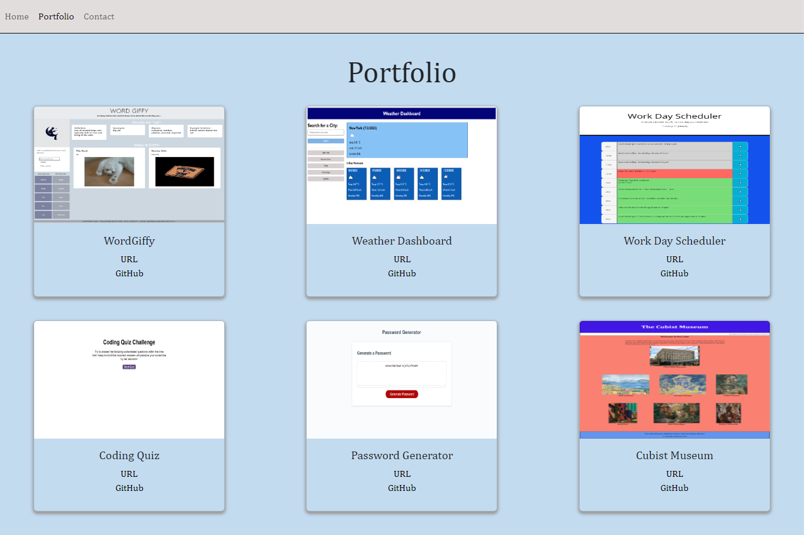

# React Portfolio (Week-13 Challenge)

## Description
The purpose of this project was to make a web design portfolio using React.js. The page consists of three page components: Home, Portfolio and Contact with a Header containing a navbar. React Router determines the file paths and arrangement of the different components of the page. The Header component is wrapped around the other components; accordingly it is always visible allowing its navbar to be used to switch between pages. Each page component function is made up predominately of Bootstrap HTML. The projects in the Portfolio gallery are displayed on a Bootstrap card template using props. Objects related to each project are stored in a JSON file which is cycled through using the maps() method. This allows the project card template to be re-used as many times as need to generate title text, an image, and links to the deployed URL and to the GitHub repo for each project displayed. The formatting for all page components and for the card template was completed inline using JSX objects to refer to the relevant CSS properties.

## Installation
N/A

## Usage
N/A

## Credits
N/A

## License
N/A

## Tests
N/A

## Questions
If you have any questions regarding the repo, open an issue or contact me directly at dra21@cam.ac.uk.
You can find more of my work at [DavidBlueLamassu](https://github.com/DavidBlueLamassu).

## https://davidbluelamassu.github.io/react-portfolio/

